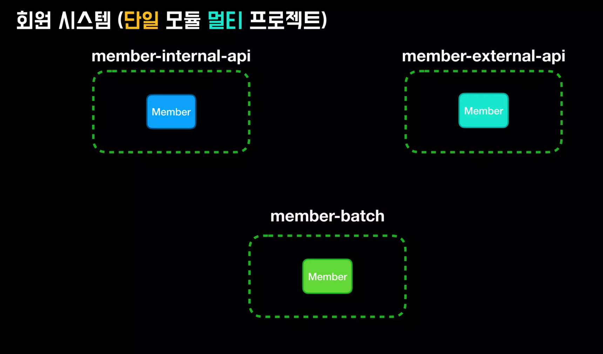
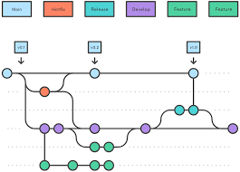

# | Git Branch 전략이란?
> 개발 중인 기능이나 수정사항이 서로 독립적이게 되며 영향을 주지 않고 동시에 개발이 진행될 수 있는데, 여러 방법으로 브랜치를 만들어서 branch 전략을 만들 수 있습니다.

## 전략 1:Trunk-Based Development(TBD)
모든 개발자가 프로젝트의 main 브랜치로 직접 커밋하고 push하는 전략을 TBD전략이라고 합니다. 
하지만, TBD기반의 개발은 기능 브랜치 사용을 최소화하고 개발자가 main에서 협업적으로 작업하도록 권장됩니다.

 - 1. 별도의 브랜치를 생성하는 대신, main에서 직접 작업한다.
 - 2. 작고 빈번한 변경작업에서 검토하기 쉽고 문제가 발생할 가능성이 줄어듭니다.
- 3. 지속적인 merge를 통해서 conflict를 피하고, 항상 릴리즈가 가능한 상태인지 확인 합니다. 

| 장점                               | 단점                                     |
|----------------------------------|----------------------------------------|
| 협업과 빠른 피드백을 할 수 있습니다.            | 적절하게 관리하지 않으면 충돌과 병합에서 문제가 발생할 수 있습니다. |
| 빠르게 문제를 파악할 수 있고, 해결도 빠르게 가능합니다. | 견고한 자동화 테스트 및 지속적인 통합 관행이 필요합니다.       |
| 더 빠른 기능 및 개선 사항 제공을 용이하게 합니다.    | 변경 사항을 merge한 후에 rollback이 쉽지가 않습니다.   |
| 모든 개발자를 동일한 브랜치에 유지할 수 있습니다.     | 대규모 팀이나 복잡한 프로젝트에는 적합하지 않을 수 있습니다.     |

=> 총체적으로 보면 conflict날 가능성이 많아서,merge를 자주해주고, 코드 관리를 계속해서 유지해야 하는 것을 볼 수 있다. 플랫폼이나 어플리케이션이 작고, 개발인원이 적다면 괜찮겠지만, 그렇지 않을시에는 많은 문제가 발생할 가능성이 크다고 봅니다.

## 전략 2:Feature Branching
특정 기능이나 변경 사항에 대해서 새 branch를 만드는 작업입니다.
이를 통해서 개발자들은 독립적인 브랜치에서 영향을 미치지 않고 독립적으로 개발을 할 수 있습니다. 그리고 브랜치 안에서 기능 개발이 완료된다면, Pull Request를 통해 main 브랜치에 병합을 할 수 있습니다.

- 1. 기능이나 작업마다 브랜치를 만듭니다.
- 2. branch에서 기능 개발이 끝난다면 풀 리퀘스트를 만들어서 merge를 합니다.
- 3. 병합하고 나서 필요없는 branch를 삭제할 수 있습니다.

| 장점                        | 단점                                      |
|---------------------------|-----------------------------------------|
| 병렬적인 기능 개발이 가능합니다.        | 다양한 브랜치 관리 및 업데이트가 필요합니다.               |
| 제어된 코드 검토/테스트를 용이하게 합니다.  | 확장된 검토로 인해 변경 사항 병합이 지연될 수 있습니다.        |
| 브랜치의 독립적인 일관된 안정성을 보장합니다. | 각기 다른 브랜치에서 중복지점이 발생한다면 충돌이 발생할 수 있습니다. |

=> 독립적인 브랜치 기능 개발이라 개발중에는 conflict가 날 걱정은 안해도 된다는 점, 하지만 만약에 branch를 merge하는 과정에서 변경사항에서 중복된 지점이 있다면 conflict날 가능성이 많습니다.

## 전략 3:Git Flow
두개의 주요 branch인 main과 develop을 사용하는 브랜치 전략으로, 프로젝트 전체 기간동안 프로젝트에서 main과 develop은 유지하고 있습니다. 또한 필요하면 생성하고 feature,release(출시 버전을 준비하는 브랜치),hotfix(출시 버전에서 발생한 버그를 수정하는 브랜치) merge되면 삭제되는 브랜치들을 통해서 새로운 기능이나 변경사항을 개발하는 데 사용됩니다.

- 1. develop branch는 개발 작업에 사용된다.
- 2. 새로운 기능이나 버그 수정작업을 시작할때는 feature 브랜치를 develop에서 분기합니다.
- 3. release 브랜치에서는 버전번호를 명시적으로 표시하고 철저히 테스트하거나 버그들을 잡아서 production 환경에서 적절한지 확인합니다.
- 4. 이러한 프로세스들을 반복합니다.

#### 참고사이트
https://tilburgsciencehub.com/topics/automation/version-control/advanced-git/git-branching-strategies/