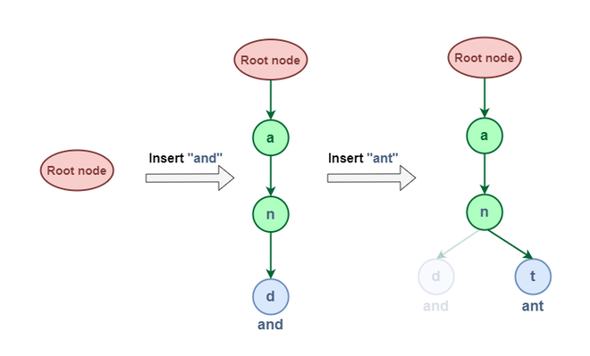

# | Trie 데이터 구조

> Trie 자료구조는 동적 문자열 집합을 저장하는 데 사용되는 Tree와 같은 자료 구조입니다.
> 일반적으로 대규모 데이터 세트에서 키를 효율적으로 검색하고 저장하는 데 사용됩니다.
> 이 구조는 키의 삽입, 검색 및 삭제와 같은 작업을 지원합니다.
> 보통 사전 및 자동 완성 기능을 구현하는데 사용됩니다.

(출처:https://www.geeksforgeeks.org/trie-insert-and-search/)

 

### | 왜 HashTable이 아닌 Trie 데이터 자료구조를 사용할까?

그 이유에는 여러가지 Trie에서 장점이 있습니다. 장점을 한 번 나열해보겠습니다.

- Trie를 이용했을때 효율적으로 prefix 검색을 할 수 있습니다.
- 해싱을 하면 쉽지 않은 모든 단어를 알파벳 순으로 정렬할 수 있습니다.
- Trie에서는 HashTable에서 나타날 수 있는 오버헤드가 없습니다.

  * HashTable에서 나타날 수 있는 오버헤드
    * 해시 충돌 : 서로 다른 키가 같은 해시 값을 가질 때 발생하는 충돌을 해결하기 위한 추가적 연산에서 오버헤드 발생
    * 해시 함수 계산 : 키를 해시 값으로 변환하는 과정에서 추가적 연산 필요

- Trie에서는 긴 단어의 문자열 검색에서도 O(L)의 시간 복잡도로 수행될 수 있습니다.

위와 같은 이유로 HashTable이 아닌 Trie 구조를 사용해서 구현합니다.

 

### | Trie 자료구조의 작동방식은?

Trie는 알파벳,숫자,특수 문자를 포함한 모든 문자를 포함할 수 있습니다.

쉽게 생각하면 노드에서 노드로 이동해서 검색한다고 생각하면 됩니다.

### 1. Trie에서 저장 및 삽입

예를 들어 a-z까지 소문자영어 단어를 저장하고 검색한다고 했을 때, 'and'와 'ant'를 저장한다고 가정했을때의 과정은 아래 이미지와 같습니다.

(출처:https://www.geeksforgeeks.org/introduction-to-trie-data-structure-and-algorithm-tutorials/)

***'and'와 'ant'를 저장하는 과정은 다음과 같습니다***

1) 루트 노드에서 시작합니다.
2) 'a'에 대한 자식 노드를 생성하고 연결합니다.
3) 'a' 노드에서 'n'에 대한 자식 노드를 생성하고 연결합니다.
4) 'n' 노드에서 'd'와 't'에 대한 각각의 자식 노드를 생성하고 연결합니다.
5) 'd'와 't' 노드를 단어의 끝을 나타내는 표시를 합니다.

이 과정에서 'and'와 'ant'는 'an'이라는 공통 접두사를 갖게 되어, 이 부분은 동일한 경로를 공유하게 됩니다. 이는 Trie의 주요 장점 중 하나로, 접두사를 공유하는 단어들에 대해 저장
공간을 <strong>효율적으로 사용</strong>할 수 있게 합니다.

### 2. Trie에서 검색

Trie의 검색 작업은 삽입 작업과 유사한 방식으로 진행되지만, 몇 가지 중요한 차이점이 있습니다.

1) 루트 노드에서 시작합니다.
2) 검색하려는 단어의 각 문자과정을 본다면

- 현재 노드에 해당 문자에 대한 자식 노드가 있다면, 해당 자식 노드로 이동합니다.
- 자식 노드가 없다면, 검색이 실패한 것이므로 false를 반환합니다.

3) 모든 문자를 순회한 후, 현재 노드가 단어의 끝을 나타내는 표시가 있다면 true를, 그렇지 않다면 false를 반환합니다.

결론적으로 삽입 과정과의 주요 차이점은, 검색 과정에서는 새로운 노드를 생성하지 않는다는 것입니다. 대신, 검색 중 어느 지점에서라도 해당 문자에 대한 자식 노드가 없다면 즉시 검색을 중단하고 false를
반환합니다.

이 방식을 통해 Trie는 문자열 검색을 매우 효율적으로 수행할 수 있으며, 특히 접두사 검색에서 뛰어난 성능을 보입니다.

이러한 구조로서 작동하기 때문에, 데이터 사전을 저장하고 사전에서 단어를 검색하기 위한 알고리즘을 쉽게 구축할 수 있도록 하며, 자동완성에 대해서 유효한 단어목록을 제공합니다.

 

### Trie 데이터 구조의 장점

- **빠른 단어 검색**: Trie는 단어의 길이를 n이라고 할 때, O(n) 시간 안에 단어를 입력하고 찾을 수 있습니다. 이는 해시 테이블이나 이진 검색 트리보다 빠를 수 있습니다.
- **알파벳순 필터링**: 노드의 키로 항목을 알파벳순으로 필터링할 수 있어, 모든 단어를 알파벳순으로 쉽게 출력할 수 있습니다.
- **효율적인 접두사 검색**: Trie를 사용하면 접두사 검색이나 가장 긴 접두사 매칭을 효율적으로 수행할 수 있습니다.
- **해시 함수 불필요**: Trie는 해시 함수를 필요로 하지 않기 때문에, 정수나 포인터와 같은 작은 키의 경우 해시 테이블보다 일반적으로 빠릅니다.
- **순서 있는 반복** : Trie는 순서 있는 반복을 지원하는 반면, 해시 테이블의 반복은 해시 함수에 의한 의사난수 순서로 이루어지므로 더 번거로울 수 있습니다.

### Trie 데이터 구조의 단점

- **높은 메모리 사용** :
  Trie의 가장 큰 단점은 모든 문자열을 저장하는 데 많은 메모리가 필요하다는 것입니다. 각 노드에 대해 최악의 경우 알파벳 수만큼의 노드 포인터가 필요할 수 있습니다.
- **효율적인 해시 테이블과 비교** : 
  잘 구성된 해시 테이블(좋은 해시 함수와 적절한 부하 계수)의 조회 시간은 O(1)입니다. 이는 문자열의 길이가 l인 Trie의 조회 시간 O(l)보다 훨씬 빠릅니다.

### 결론

Trie는 접두사 검색, 자동 완성, 사전 구현 등에서 매우 효율적이며, 데이터의 순서가 중요할 때 유용합니다. 많은 문자열을 저장하고 접두사 검색을 자주 수행해야 하는 애플리케이션에서는 Trie가 적합하지만, 일반적인 키-값 쌍을 빠르게 조회해야 하는 경우에는 HashTable이 더 나은 선택이 될 수 있습니다.

#### 참고사이트

https://www.geeksforgeeks.org/trie-insert-and-search/
https://www.geeksforgeeks.org/introduction-to-trie-data-structure-and-algorithm-tutorials/